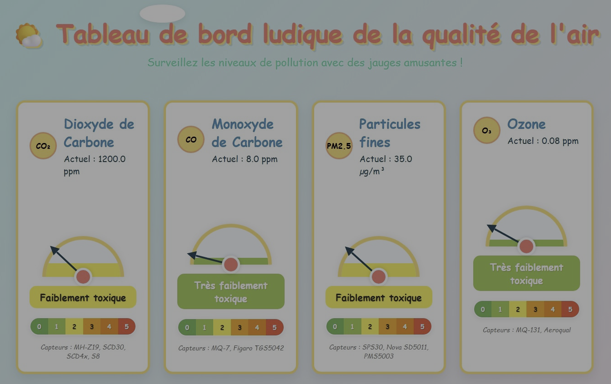

# Modul'Air Dashboard Simulation



## Installation
1. Récupération du dépot
   
```bash
    cd ~
    git clone https://github.com/Thierry-G/modul-air.git
    cd modul-air/workshops/simulation/dashboard
```

2. Installation de l'environnement Python & Flask
   
   [Créer un environnement virtuel Python et installer Flask](/workshops/Fiche_venv_flask.md)

3. Activation du serveur Flask

```bash
    cd ~
    cd modul-air/workshops/simulation/dashboard
```

**Windows**

```bash
    .\venv\Scripts\activate
    python app.py
```

**Linux**

```bash
    venv/bin/activate
    python app.py
```

4. Visualisation
   
      Ouvrez votre navigateur à `http://localhost:5000/` 